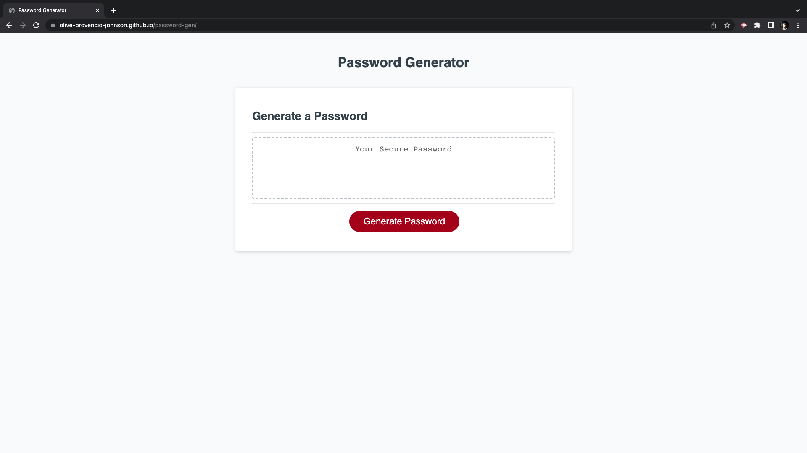

# Password-Generator

 
## Description
 This password generator was created using JavaScript, asking users to choose a password between 8 - 128 characters, and providing the options to incorporate uppercase, lowercase, numbers, and special characters into their password that will be generated using the javascript functions, methods, and loops written here. The final product is a strong password that provides greater security for the user. 
 
## Issues Addressed Here
- When a user needs a new password, they are able to click the generate password button, which presents them with a series of prompts for password criteria. 
- When a user is prompted for password criteria, they are first asked for a prompt for the password length between 8 - 128 characters. - When a user is asked for which character types they would like to include in their password, then there are a series of confirms whether or not to include lowercase, uppercase, numeric, and/or special characters. 
- IF a user should select cancel, or no, to each prompt asking for character types (lowercase, uppercase, numeric, and/or special characters), then a validation is used to ask the user to select at least one character type. 
- When a user answers all prompts, then a password is generated that matches the selected criteria provided by the user. 
- When the password is generated, then the password is displayed on the page

## Usage
This webpage can be viewed on regular desktop browser or mobile device. 

## Project Links and Screenshot
 The following image demonstrates the web application's appearance and functionality:

[Link to live webpage](https://olive-provencio-johnson.github.io/password-gen/)

 
## License
 
MIT License
---
 